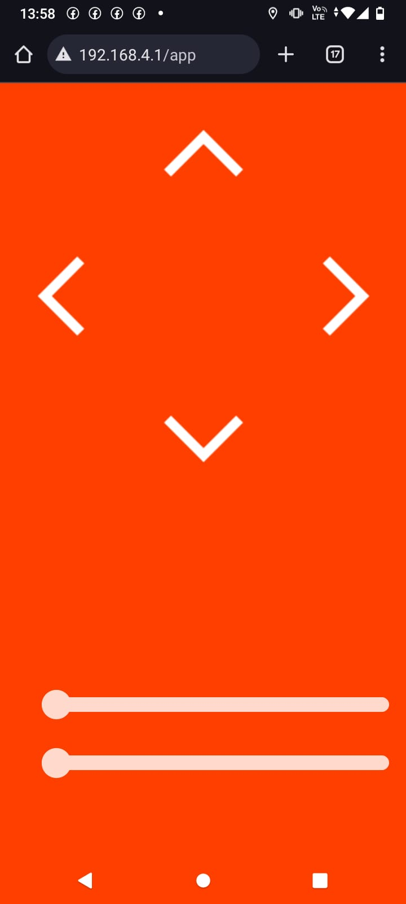

# App de Controle de Robôs com ESP8266

## Visão Geral

Este projeto permite controlar robôs remotamente através de uma interface web usando um ESP32. A aplicação web possibilita o controle do movimento do robô (frente, trás, esquerda, direita) e também permite o ajuste de componentes específicos, como garras e velocidade de motores, utilizando sliders.

## Autor

- **Criado por:** Elismar Silva
- **Data:** 14 de outubro de 2024
- **Versão:** 1.0

### Passos para Instalar o Plugin

1. **Baixar o Plugin ESP8266FS**  
   - Acesse o repositório oficial no GitHub:  
     [ESP8266FS Plugin](https://github.com/esp8266/arduino-esp8266fs-plugin).
   - Faça o download do arquivo `.zip` do plugin.

2. **Instalar o Plugin**  
   - Extraia o arquivo `.zip`.  
   - Localize a pasta **`tools`** no diretório de instalação do Arduino IDE:  
     - **Windows**: `C:\Users\<Seu_Usuário>\Documents\Arduino\tools`  
     - **Linux/macOS**: `~/Arduino/tools`  
   - Se a pasta `tools` não existir, crie-a.  
   - Copie a pasta extraída do plugin para dentro de `tools`.  
     - O caminho final deve ser algo como:

       ferramentas/ESP8266FS/ferramenta/esp8266fs.jar
       
3. **Reinicie o Arduino IDE**  
   - Após a instalação, reinicie o Arduino IDE para que o plugin seja carregado.

4. **Selecionar a Placa ESP8266**  
   - Abra o Arduino IDE e vá em:  
     `Ferramentas > Placa > ESP8266 > Modelo da sua Placa`  
     (ex.: NodeMCU 1.0, ESP-01, Wemos D1 Mini).

5. **Abrir a Ferramenta de Upload SPIFFS**  
   - No menu do Arduino IDE, vá em:  
     `Ferramentas > ESP8266 Sketch Data Upload`.  
   - Se a opção não aparecer, verifique se o plugin foi instalado corretamente.

---

### Como Subir Imagens para a Flash

1. **Organizar os Arquivos**  
   - Crie uma pasta chamada **`data`** no mesmo diretório onde está o código do seu projeto.  
     Exemplo de estrutura de pastas:

     /MeuProjeto/ |-- MeuProjeto.ino |-- data/ |-- frente.png |-- esquerda.png |-- direita.png |-- tras.png
     
2. **Fazer o Upload**  
   - Abra o projeto no Arduino IDE.  
   - Certifique-se de que a placa ESP8266 está conectada e selecionada.  
   - Vá em:  
     `Ferramentas > ESP8266 Sketch Data Upload`.  
     O Arduino IDE fará o upload dos arquivos da pasta `data` para o sistema de arquivos SPIFFS do ESP8266.

3. **Verificar os Arquivos**  
   - No código, utilize funções da biblioteca **`FS.h`** para acessar e servir os arquivos armazenados.

---

### Observações

- Certifique-se de que o sistema SPIFFS esteja ativado e configurado corretamente no seu projeto.  
- Caso encontre problemas, verifique o log no monitor serial para possíveis mensagens de erro.
 depois do exemplo de codigo esta tudo celecionado eu nao quer

## Funcionalidades

- Controle de movimento: Frente, Trás, Esquerda, Direita e Parado.
- Ajuste de parâmetros via sliders, como garras e velocidade.
- Interface web para controle do robô, acessada via um ponto de acesso Wi-Fi criado pelo ESP32.
- Controle via comandos HTTP, tornando o uso flexível e fácil de integrar com outros dispositivos.

## Imagem do App



## Estrutura do Projeto

- **Bibliotecas Utilizadas:**
  - `WiFi.h`: Para configuração da rede Wi-Fi.
  - `WebServer.h`: Para criação do servidor web.
  - `SPIFFS.h`: Para armazenamento e recuperação de arquivos SPIFFS.
  - `ESP32Servo.h`: Para controle dos servos motores.

- **Arquivos Importantes:**
  - `html.h`: Contém o código HTML para a interface web.
  - Imagens (ex: `frente.png`, `esquerda.png`, `direita.png`, `tras.png`) para os ícones da interface.

## Configuração do Hardware

- **ESP32** como servidor web.
- **Servos** para controle das rodas e garra.
- **Sistema de Arquivos SPIFFS** para armazenar e servir arquivos da interface.

## Instruções de Uso

1. **Conexão e Configuração Wi-Fi:**
   - O ESP32 cria uma rede chamada `MoveX` (senha vazia por padrão) para permitir acesso ao controle do robô.
   - O IP da rede Wi-Fi do ponto de acesso é exibido no monitor serial para fácil acesso.

2. **Controle via Interface Web:**
   - Conecte-se à rede `MoveX`.
   - Acesse o endereço `http://<IP_DO_ESP32>/app` no navegador para visualizar a interface de controle.

3. **Comandos de Controle:**
   - **Frente:** `/F`
   - **Trás:** `/T`
   - **Esquerda:** `/E`
   - **Direita:** `/D`
   - **Parado:** `/P`

4. **Controle dos Sliders:**
   - Envie valores para ajustar configurações específicas como garras e velocidade de motores.

## Exemplo de Código

```cpp
void frente() {
  Serial.println("Frente");
  moverRobo(180, 0, "Movendo para frente"); // O robô se movimenta para frente
}

void tras() {
  Serial.println("Trás");
  moverRobo(0, 180, "Movendo para trás"); // O robô se movimenta para trás
}

void esquerda() {
  Serial.println("Esquerda");
  moverRobo(0, 0, "");
  server.send(200, "text/plain", ""); // O robô se movimenta para esquerda
}

void direita() {
  Serial.println("Direita");
  moverRobo(180, 180, "");
  server.send(200, "text/plain", ""); // O robô se movimenta para direita
}

void parado() {
  Serial.println("Parado");
  moverRobo(90, 90, "Parado");
  server.send(200, "text/plain", "Parado"); // O robô fica parado
}

